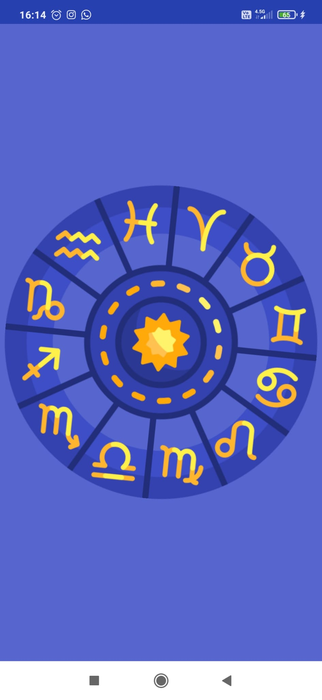
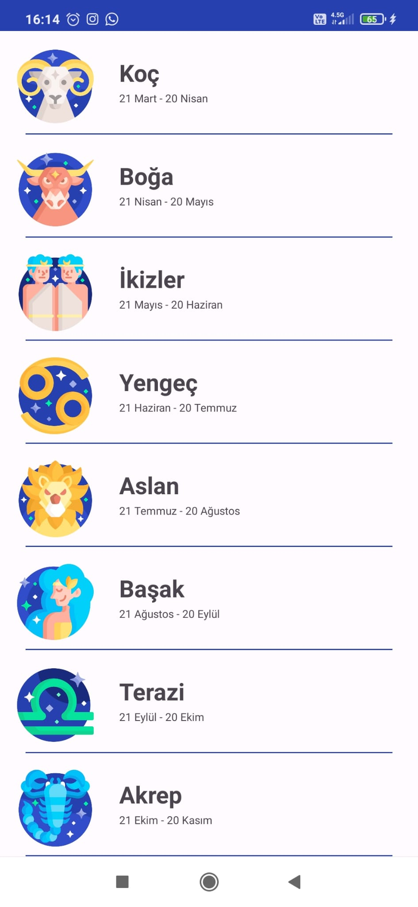
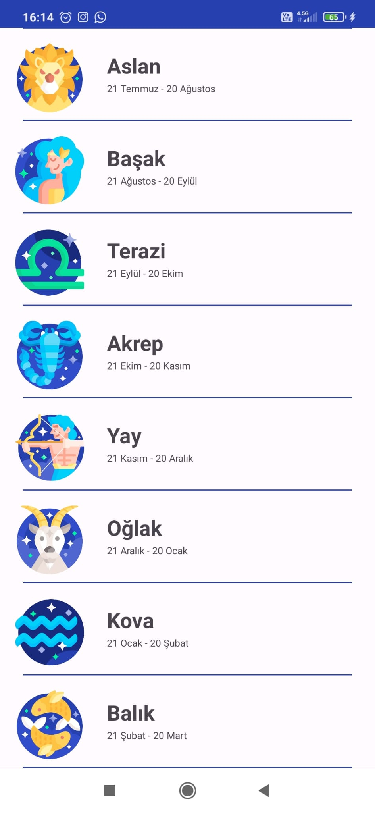
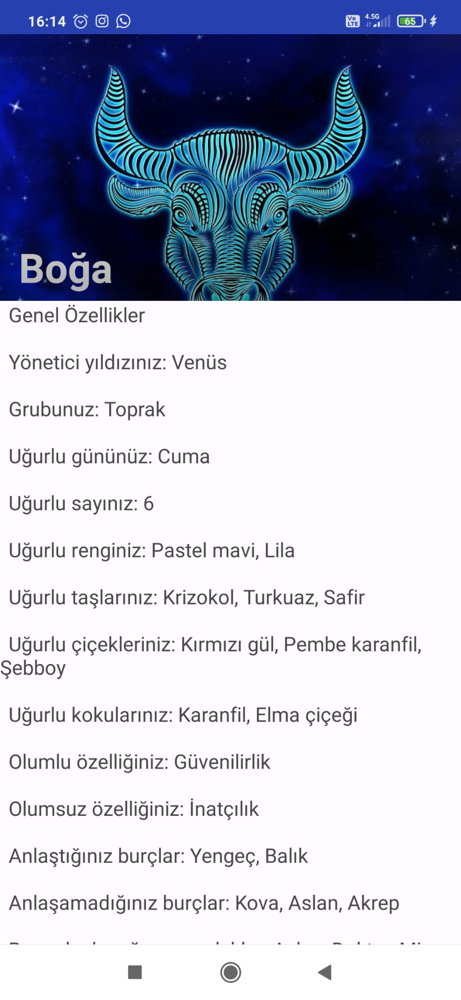

# ZODIAC SIGNS
This project is an application that aims to provide basic information about horoscopes to users who are interested in astrology. The project has been developed as an Android application.

## Features
- Characteristics of all zodiac signs
- Zodiac signs such as ruler star, zodiac group, auspicious day, color, flower, scent
- Your positive and negative traits, the signs you agree and disagree with. Successful careers and famous people with the same sign as you

## Screenshots

## Requirements
- Android 6.0 Marshmallow and higher operating system

## Setup
- Clone this repository: `git clone https://github.com/CanSamet0/horoscope-informations.git`
- Open Android Studio and import the project
- Run the app on the emulator or a physical Android device.
